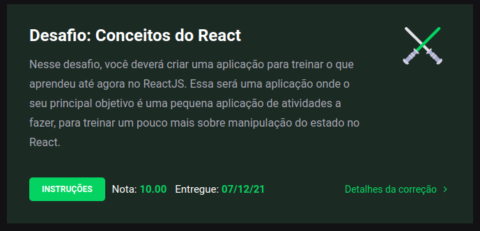

<h1 align="center">
  💻 Ignite - Conceitos do React.js
</h1>

<h4 align="center"><a href="https://www.rocketseat.com.br/ignite">Clique para visitar o curso</a></h4>

## 📚 Descrição

Essa será uma aplicação onde o seu principal objetivo é uma pequena aplicação de atividades a fazer, para treinar um pouco mais sobre a manipulação do estado no React.

---

## 💼 Tecnologias utilizadas

Para o desenvolvimento deste site utilizei as seguintes tecnologias:

- HTML;
- CSS;
- Javascript;
- React;

---

<h2>Autor</h2>

<table>
  <tr>
    <td align="center">
      <a href="https://github.com/daniel-soaress">
         
        
          <b>Daniel Soares</b>
        
      </a>
    </td>
  </tr>
</table>
